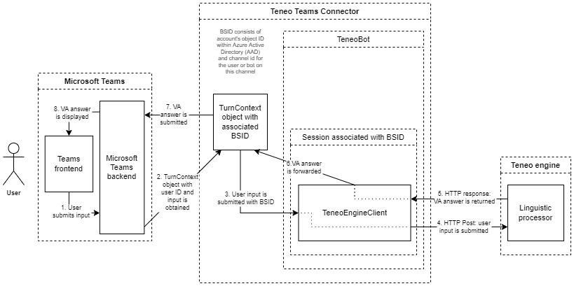

# Teneo Microsoft Teams Connector

This Java Connector connects Microsoft Teams to a Teneo-built Virtual Assistant (VA) so the Teams messenger acts as a frontend to the Teneo engine (the VA backend). In this way, users can chat via Teams with a Teneo engine instead of with a real person. One instance of this connector can serve multiple users talking to one published Teneo engine simultaneously.
## Prerequisites

### Teneo Engine

Your bot needs to be published and you need to know the Engine URL.

### Java 

To run the connector you need Java version 17 or higher. 

To run the connector locally, [ngrok](https://ngrok.com/) is preferred to make the connector available via HTTPS on port 3978.

## The description of the software

Teneo Microsoft Teams Connector is a Java console application. It requires JVM version 17 or higher. No firewalls etc should prevent its communication with Microsoft Bot API.

The functioning of the connector is illustrated in the following functional diagram:

The sequence of the steps depicted in the diagram is as follows:

1. User submits his/her message into Teams messenger.

2. User's input is submitted to the connector by the Microsoft teams backend. The connector creates a `TurnContext` object (an instance of `com.microsoft.bot.builder.TurnContext`) for the given user interaction and generates a so-called bridge session ID (BSID) consisting the account's object ID within Azure Active Directory (AAD) and the channel id for the user or bot on this channel. The connector checks then via its singleton bridge object (an instance of `com.artificialsolutions.teamsconnector.TeneoBot`) if there already exists a session (an instance of `com.artificialsolutions.teamsconnector.TeneoBot.BridgeSession`) identified via this BSID. If no such session exists, it is created and its timeout countdown is started. If it already exists, it is returned and its timeout countdown is restarted. Each session object has its own instance of Teneo engine client (`com.artificialsolutions.teneoengine.TeneoEngineClient`) to talk to Teneo engine.

3. The connector submits the user input to the Teneo engine client.

4. The Teneo engine client forwards the user's message to the Teneo engine with a POST request.

5. The Teneo engine client receives Virtual Assistant's answer in the response.

6. Virtual Assistant's answer is passed to the `TurnContext` object obtained at step 2.

7. The `TurnContext` object submits the answer to the Microsoft Bot API.

8. The answer is displayed to the user.

## Setting up a bot in Azure
An Azure account with an active subscription is required. [Create an account for free](https://azure.microsoft.com/free/?utm_source=campaign&utm_campaign=vscode-tutorial-app-service-extension&mktingSource=vscode-tutorial-app-service-extension).

  

Access [https://portal.azure.com](https://portal.azure.com) and create a bot there. Go to the bot's configuration and add the connectors' public URL in the field **Messaging endpoint** in the format `https://YOUR-PUBLIC-DOMAIN/api/messages` where `YOUR-PUBLIC-DOMAIN` is the public domain your connector is running on.

## Configuring the connector

The application is configured in the `application.properties` file (to be found in `src\main\resources` in the source code). The following configuration properties are implemented.

* `server.port` - the port the connector is available on localhost (for example, 3978)
* `MicrosoftAppType`, `MicrosoftAppId`, `MicrosoftAppPassword`, `MicrosoftTenantId` - see [here](https://learn.microsoft.com/en-us/azure/bot-service/bot-service-manage-overview)
* `microsoft.graph.request.params` - the user-related request parameters to be added to Teneo engine requests: `UserPrincipalName`, `GivenName`, `Surname`, `Mail`, `Department`, `EmployeeId`, `AgeGroup`, `City`, `CompanyName`, `ConsentProvidedForMinor`, `Country`, `DisplayName`, `EmployeeType`, `ExternalUserState`, `FaxNumber`, `JobTitle`, `LegalAgeGroupClassification`, `MailNickname`, `MobilePhone`, `OfficeLocation`, `PostalCode`, `PreferredLanguage`, `State`, `StreetAddress`, `UserType`, `UsageLocation`, `MySite`, `AboutMe`, `PreferredName` as per [https://learn.microsoft.com/en-us/powershell/module/microsoft.graph.users/update-mguser](https://learn.microsoft.com/en-us/powershell/module/microsoft.graph.users/update-mguser)
* `teneo.engine.endpointUrl` - the Teneo engine endpoint (the URL of the virtual assistant backend)
* `teneo.engine.connectTimeoutMillis` - the timeout to connect with Teneo engine, in milliseconds
* `teneo.engine.responseTimeoutMillis` - the timeout to wait for Teneo engine responses, in milliseconds
* `bridge.sessionTimeoutMillis` - the timeout for the sessions created by the bridge, in milliseconds; it is recommendable to have it slightly longer then the session timeout of Teneo engine, which is normally 10 minutes (600 seconds, 600000 milliseconds)
* `bridge.maxParallelSessions` - the maximum number of simultaneous sessions for the bridge; this number can be kept high (tens of thousands), although not too high since its purpose is to reduce the risk or the application running out of memory if the number of session increases too much
* `application.explicitData` - the Boolean value indicating if some error and debug information should be added to requests sent both to Teneo engine and displayed to users in Teams. This property is not obligatory and defaults to `false`. It should only be set to `true` for testing and troubleshooting

An example configuration file `asolfbconnector.properties` is supplied with this app.

Regarding the logger configuration (file `log4j2.json` in `src\main\resources` in the source code), in order to test the application it is highly recommended to have it on the `debug` or `trace` level. If you have it on those sensitivity levels, it might log some PII, like user BSIDs, user inputs etc. Thus it should be set to have less sensitivity in production (`info` or `warn` for example).

### Teneo Solution configuration

_Data received by Teneo engine from Connector_

The requests received by Teneo engine contain the following parameters:

* `viewtype`, value: `tieapi`
* `channel`, value: `Teams`
* `userinput`, value: the input text if the user submitted it

Additionally the request will contain all the parameters/values available via the `com.microsoft.bot.schema.Activity.getValue()` provided this call returned a `Map` instance. Moreover, the user-related parameters configured in `microsoft.graph.request.params` will also be added.

_Data returned by Teneo engine (Teneo solution) to Connector_

Teneo engine normally returns a text as its answer. This text is then displayed in Teams to the user. If [adaptive cards]((https://learn.microsoft.com/en-us/microsoftteams/platform/task-modules-and-cards/cards/cards-reference#adaptive-card)) should be returned, they should be placed in the output parameter `msbotframework` as a well formed JSON. (Splitting answers into 'bubbles')[https://www.teneo.ai/resource/channels/teneo-web-chat#message-types_splitting-answers-into-bubbles] is also supported via the output parameter `outputTextSegmentIndexes`.